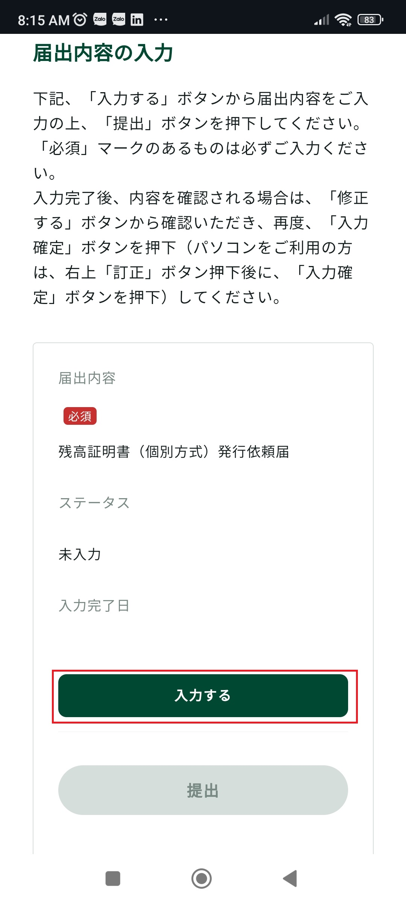

## Những giấy tờ chứng minh tài sản

- Giấy sao kê số dư thẻ ngân hàng (預貯金通帳の写し).
- Đối với những ai đã mua nhà, thì có giấy chứng nhận sở hữu nhà đất (不動産の登記事項証明書).

Bài viết này sẽ hướng dẫn bạn cách lấy trực tuyến các giấy tờ nói trên.

## Lấy giấy sao kê số dư thẻ ngân hàng.

  

      

          <h4 class="panel-title">
              <a class="noCrossRef accordion-toggle" data-toggle="collapse" data-parent="#accordion" href="#collapseOne">1. Nộp đơn trực tuyến</a>
          </h4>
      

      

          

              <table style="border:none; border-collapse:collapse; cellspacing:0; cellpadding:0" >
                <thead>
                  <tr>
                    <th>1.1. Đăng nhập vào ứng dụng 三井住友銀行アプリ >> chọn <code class="language-plaintext highlighter-rouge">Menu</code></th>
                    <th>1.2. Chọn <code class="language-plaintext highlighter-rouge">List of Services</code></th>
                  </tr>
                </thead>
                <tbody>
                  <tr>
                    <td></td>
                    <td></td>
                  </tr>
                </tbody>
              </table>
              <table style="border:none; border-collapse:collapse; cellspacing:0; cellpadding:0" >
                <thead>
                  <tr>
                    <th>1.3. Cuộn xuống >> chọn <code class="language-plaintext highlighter-rouge">残高証明書の発行</code></th>
                    <th>1.4. Chọn <code class="language-plaintext highlighter-rouge">Yes</code>để làm thủ tục trên một Browser (ví dụ Chrome)</th>
                  </tr>
                </thead>
                <tbody>
                  <tr>
                    <td></td>
                    <td></td>
                  </tr>
                </tbody>
              </table>
              <table style="border:none; border-collapse:collapse; cellspacing:0; cellpadding:0" >
                <thead>
                  <tr>
                    <th>1.5. Sau đó, bạn sẽ được chuyển sang làm thủ tục trên ứng dụng Chrome</th>
                    <th>1.6. Cuộn xuống >> tích vào ô <code class="language-plaintext highlighter-rouge">注意事項について確認し、内容について承認しました。</code> >> chọn <code class="language-plaintext highlighter-rouge">次へ</code></th>
                  </tr>
                </thead>
                <tbody>
                  <tr>
                    <td></td>
                    <td></td>
                  </tr>
                </tbody>
              </table>
              <table style="border:none; border-collapse:collapse; cellspacing:0; cellpadding:0" >
                <thead>
                  <tr>
                    <th>1.7. SMBC sẽ gửi mã xác thực vào email của bạn >> Điền mã đó vào ô <code class="language-plaintext highlighter-rouge">確認コード</code> >> chọn <code class="language-plaintext highlighter-rouge">検証</code></th>
                    <th>1.8. Cuộn xuống >> chọn <code class="language-plaintext highlighter-rouge">入力する</code></th>
                  </tr>
                </thead>
                <tbody>
                  <tr>
                    <td></td>
                    <td></td>
                  </tr>
                </tbody>
              </table>
              <table style="border:none; border-collapse:collapse; cellspacing:0; cellpadding:0" >
                <thead>
                  <tr>
                    <th>1.9. Cuộn xuống >> chọn <code class="language-plaintext highlighter-rouge">次へ</code></th>
                    <th>1.10. Tích vào chi nhánh phát hành giấy chứng nhận số dư tài khoản >> chọn <code class="language-plaintext highlighter-rouge">次へ</code></th>
                  </tr>
                </thead>
                <tbody>
                  <tr>
                    <td></td>
                    <td></td>
                  </tr>
                </tbody>
              </table>
              <table style="border:none; border-collapse:collapse; cellspacing:0; cellpadding:0" >
                <thead>
                  <tr>
                    <th>1.11. Chọn các loại giấy tờ phù hợp với bản thân trong mục <code class="language-plaintext highlighter-rouge">証明科目</code> >> chọn ngày phát hành >> chọn số lượng giấy chứng nhận >> chọn <code class="language-plaintext highlighter-rouge">次へ</code></th>
                    <th>1.12. Cuộn xuống >> chọn <code class="language-plaintext highlighter-rouge">次へ</code></th>
                  </tr>
                </thead>
                <tbody>
                  <tr>
                    <td></td>
                    <td></td>
                  </tr>
                </tbody>
              </table>
              <table style="border:none; border-collapse:collapse; cellspacing:0; cellpadding:0" >
                <thead>
                  <tr>
                    <th>1.13. Chọn tài khoản ngân hàng để thanh toán phí xử lý (880 yên) >> chọn <code class="language-plaintext highlighter-rouge">入力確定</code></th>
                    <th>1.14. Cuộn xuống >> chọn <code class="language-plaintext highlighter-rouge">提出</code></th>
                  </tr>
                </thead>
                <tbody>
                  <tr>
                    <td></td>
                    <td></td>
                  </tr>
                </tbody>
              </table>
              <table style="border:none; border-collapse:collapse; cellspacing:0; cellpadding:0" >
                <thead>
                  <tr>
                    <th>1.15. Chọn <code class="language-plaintext highlighter-rouge">はい</code></th>
                    <th>1.16. Cuộn xuống >> chọn <code class="language-plaintext highlighter-rouge">確認する</code></th>
                  </tr>
                </thead>
                <tbody>
                  <tr>
                    <td></td>
                    <td></td>
                  </tr>
                </tbody>
              </table>
          

      

  

<!-- /.panel-group -->

2. Sau khi nộp đơn trực tuyến, hãy kiểm tra hòm thư điện tử xem đơn của bạn đã được chấp nhận chưa.

3. Sau khoảng 1-2 tuần, ngân hàng sẽ gửi giấy chứng nhận về địa chỉ nhà cho bạn.

## Lấy giấy chứng nhận sở hữu nhà đất.

Bạn vui lòng tham khảo hướng dẫn tại [đây](https://houmukyoku.moj.go.jp/homu/shomeisho_000001.html).
