## Giấy chứng nhận nộp bảo hiểm hưu trí trông như thế nào?

Giấy chứng nhận nộp bảo hiểm hưu trí có thể là một trong số 3 loại giấy sau:
- ねんきん定期便: đây không phải là phiếu ハガキ mà cơ quan bảo hiểm hưu trí gửi cho bạn hàng năm, mà đó là một phong thư được gửi về nhà cho bạn vào các năm 35, 45 và 59 tuổi.
- 各月の年金記録: đây là hồ sơ lương hưu hàng tháng của bạn.
- 国民年金保険料領収証書: đây là biên lai chứng nhận bạn đã nộp phí bảo hiểm hưu trí quốc gia.

## Nộp loại giấy tờ nào khi làm thủ tục vĩnh trú?

Có hai loại hình bảo hiểm hưu trí là 厚生年金 và 国民年金.
- Nếu bạn tham gia bảo hiểm 厚生年金 (hầu hết những người làm nhân viên văn phòng đều tham gia loại hình bảo hiểm này):
    - nếu bạn dưới 35 tuổi, bạn chỉ cần nộp 各月の年金記録.
    - nếu bạn trên 35 tuổi, bạn có thể nộp 各月の年金記録 hoặc ねんきん定期便.
- Nếu bạn tham gia bảo hiểm 国民年金, và số điểm của bạn lớn hơn hoặc bằng 80:
    - nếu bạn đã tham gia từ cách đây hơn một năm, bạn chỉ cần nộp bản sao 国民年金保険料領収証書 trong vòng 1 năm.
    - nếu bạn tham gia chưa đủ một năm:
        - nếu bạn dưới 35 tuổi, cần nộp bản sao 国民年金保険料領収証書 và 各月の年金記録.
        - nếu bạn trên 35 tuổi, bạn cần nộp bản sao 国民年金保険料領収証書 và 各月の年金記録 hoặc ねんきん定期便.

## Có những cách nào?

Nếu bạn đã có thẻ `My Number`, bạn có thể đăng nhập vào trang `ねんきんネット` để lấy `各月の年金記録`. Bài viết này sẽ hướng dẫn bạn lấy 各月の年金記録 trực tuyến.

## Cách làm trực tuyến.

### Chuẩn bị

1. Thẻ `My Number`.
2. Điện thoại thông minh.
- có khả năng đọc được thẻ NFC (Nếu điện thoại của bạn quẹt được SUICA hoặc PASMO là OK).
- đã cài đặt ứng dụng `Mynaportal`.
3. Máy tính cá nhân.
4. Máy in.

### Các bước thực hiện

  

      

          <h4 class="panel-title">
              <a class="noCrossRef accordion-toggle" data-toggle="collapse" data-parent="#accordion" href="#collapseZero">0. Đăng kí tài khoản trên trang</a>
          </h4>
      

      

          

              <table style="border:none; border-collapse:collapse; cellspacing:0; cellpadding:0" >
                <thead>
                  <tr>
                    <th>0.1. Trên máy tính cá nhân, truy cập trang <a href="https://www.nenkin.go.jp/n_net/">ねんきんネット</a>&nbsp;» <code class="language-plaintext highlighter-rouge">新規登録</code>. Sau đó làm theo hướng dẫn để tạo tài khoản.</th>
                  </tr>
                </thead>
                <tbody>
                  <tr>
                    <td>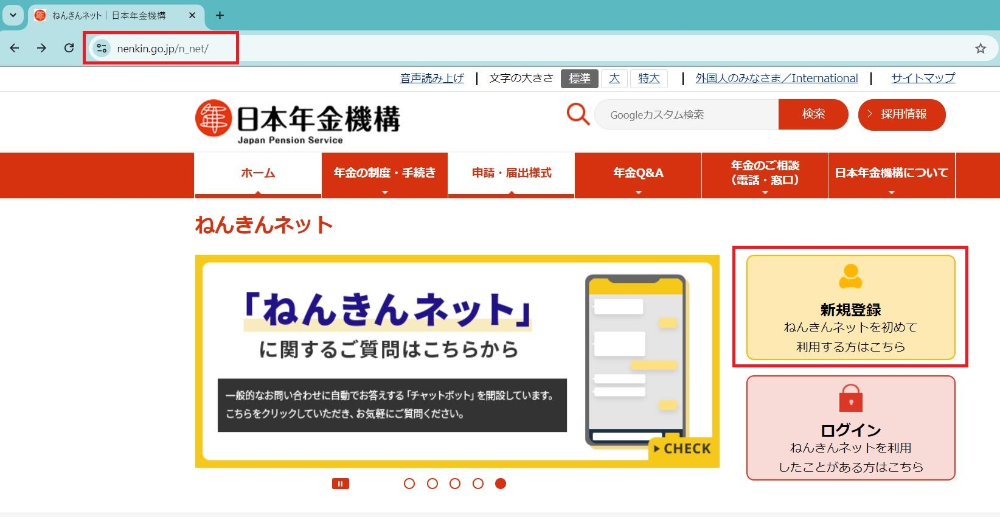</td>
                  </tr>
                </tbody>
              </table>
              
0.2. Bạn chờ khoảng vài ngày để tài khoản của bạn được tạo.

          

      

  

  <!-- /.panel -->
  

      

          <h4 class="panel-title">
              <a class="noCrossRef accordion-toggle" data-toggle="collapse" data-parent="#accordion" href="#collapseOne">1. Đăng nhập vào ứng dụng Mynaportal</a>
          </h4>
      

      

          

              <table style="border:none; border-collapse:collapse; cellspacing:0; cellpadding:0" >
                <thead>
                  <tr>
                    <th>1.1. Trên máy tính cá nhân, truy cập trang <a href="https://myna.go.jp/">Myna Portal</a>&nbsp;» <code class="language-plaintext highlighter-rouge">ログイン</code></th>
                  </tr>
                </thead>
                <tbody>
                  <tr>
                    <td>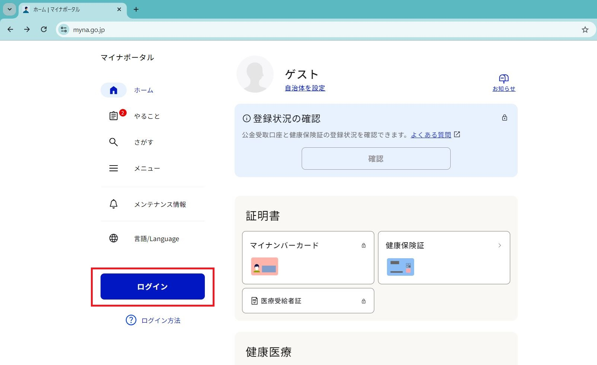</td>
                  </tr>
                </tbody>
              </table>
              <table style="border:none; border-collapse:collapse; cellspacing:0; cellpadding:0" >
                <thead>
                  <tr>
                    <th>1.2. Chọn <code class="language-plaintext highlighter-rouge">スマートフォンでQRコードを読み取ってログイン</code></th>
                  </tr>
                </thead>
                <tbody>
                  <tr>
                    <td>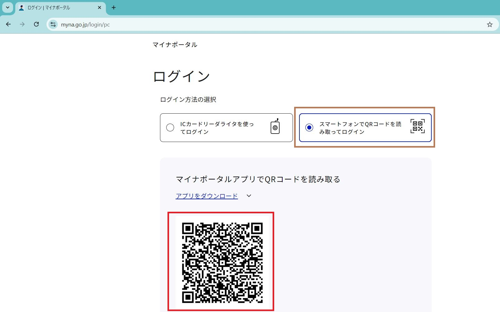</td>
                  </tr>
                </tbody>
              </table>
              <table style="border:none; border-collapse:collapse; cellspacing:0; cellpadding:0" >
                <thead>
                  <tr>
                    <th>1.3. Trên điện thoại, mở ứng dụng Mynaportal >> chọn <code class="language-plaintext highlighter-rouge">Scan QR Code</code></th>
                    <th>1.4. Quét mã QR ở bước 1.2</th>
                  </tr>
                </thead>
                <tbody>
                  <tr>
                    <td>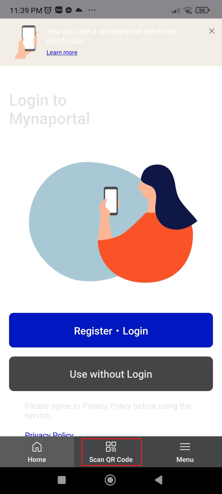</td>
                    <td>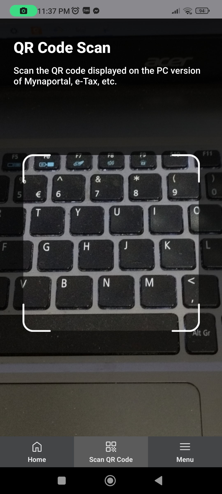</td>
                  </tr>
                </tbody>
              </table>
              <table style="border:none; border-collapse:collapse; cellspacing:0; cellpadding:0" >
                <thead>
                  <tr>
                    <th>1.5. Nhập mật khẩu thẻ My Number&nbsp;» <code class="language-plaintext highlighter-rouge">Login</code></th>
                    <th>1.6. Đưa điện thoại áp lên trên thẻ</th>
                  </tr>
                </thead>
                <tbody>
                  <tr>
                    <td>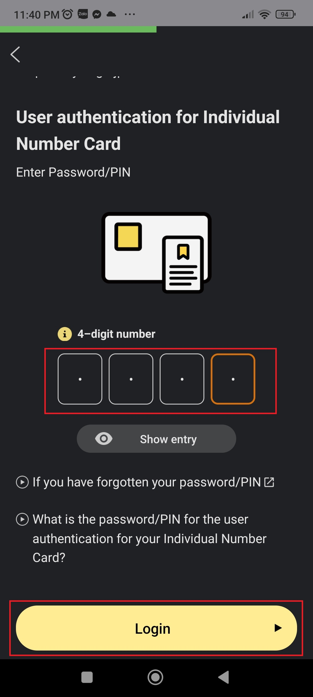</td>
                    <td>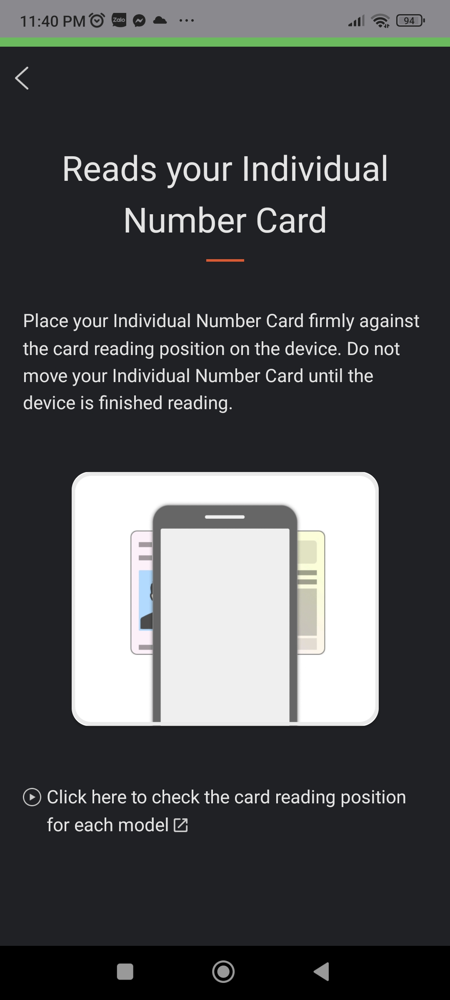</td>
                  </tr>
                </tbody>
              </table>
          

      

  

  <!-- /.panel -->
  

      

          <h4 class="panel-title">
              <a class="noCrossRef accordion-toggle" data-toggle="collapse" data-parent="#accordion" href="#collapseTwo">2. Lấy 各月の年金記録</a>
          </h4>
      

      

          

              <table style="border:none; border-collapse:collapse; cellspacing:0; cellpadding:0" >
                <thead>
                  <tr>
                    <th>2.1. Sau khi đã đăng nhập được vào Mynaportal trên máy tính cá nhân, chọn <code class="language-plaintext highlighter-rouge">年金</code></th>
                  </tr>
                </thead>
                <tbody>
                  <tr>
                    <td>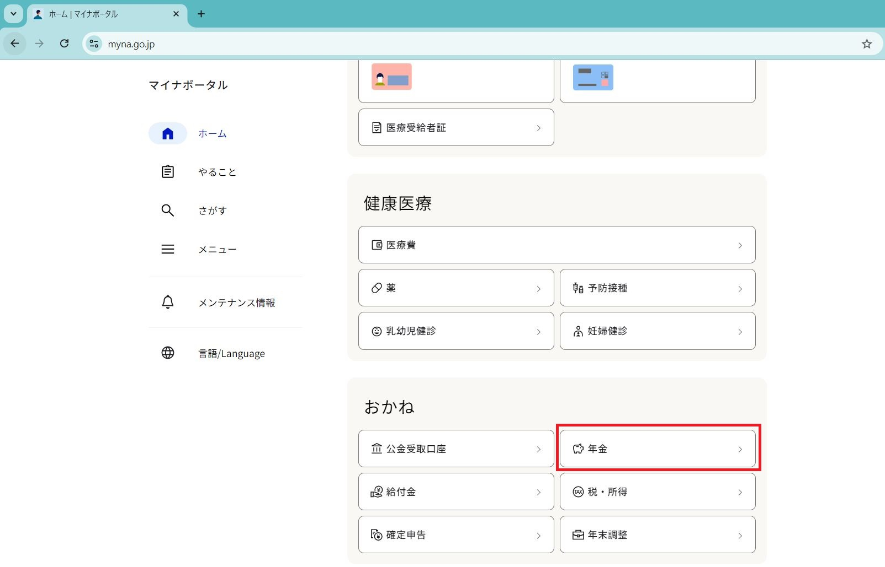</td>
                  </tr>
                </tbody>
              </table>
              <table style="border:none; border-collapse:collapse; cellspacing:0; cellpadding:0" >
                <thead>
                  <tr>
                    <th>2.2. Chọn <code class="language-plaintext highlighter-rouge">年金記録を確認</code></th>
                  </tr>
                </thead>
                <tbody>
                  <tr>
                    <td>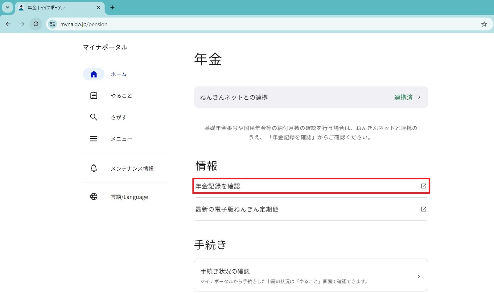</td>
                  </tr>
                </tbody>
              </table>
              <table style="border:none; border-collapse:collapse; cellspacing:0; cellpadding:0" >
                <thead>
                  <tr>
                    <th>2.3. Chọn <code class="language-plaintext highlighter-rouge">月別の年金記録を確認する</code></th>
                  </tr>
                </thead>
                <tbody>
                  <tr>
                    <td>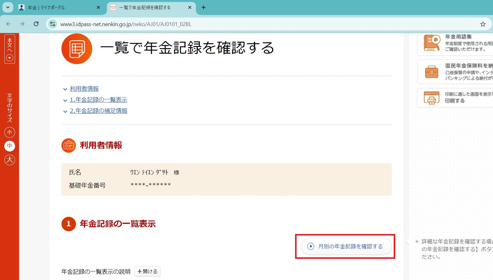</td>
                  </tr>
                </tbody>
              </table>
              <table style="border:none; border-collapse:collapse; cellspacing:0; cellpadding:0" >
                <thead>
                  <tr>
                    <th>2.4. Chọn <code class="language-plaintext highlighter-rouge">すべての記録</code> >> <code class="language-plaintext highlighter-rouge">選択した年代を表示する</code></th>
                  </tr>
                </thead>
                <tbody>
                  <tr>
                    <td>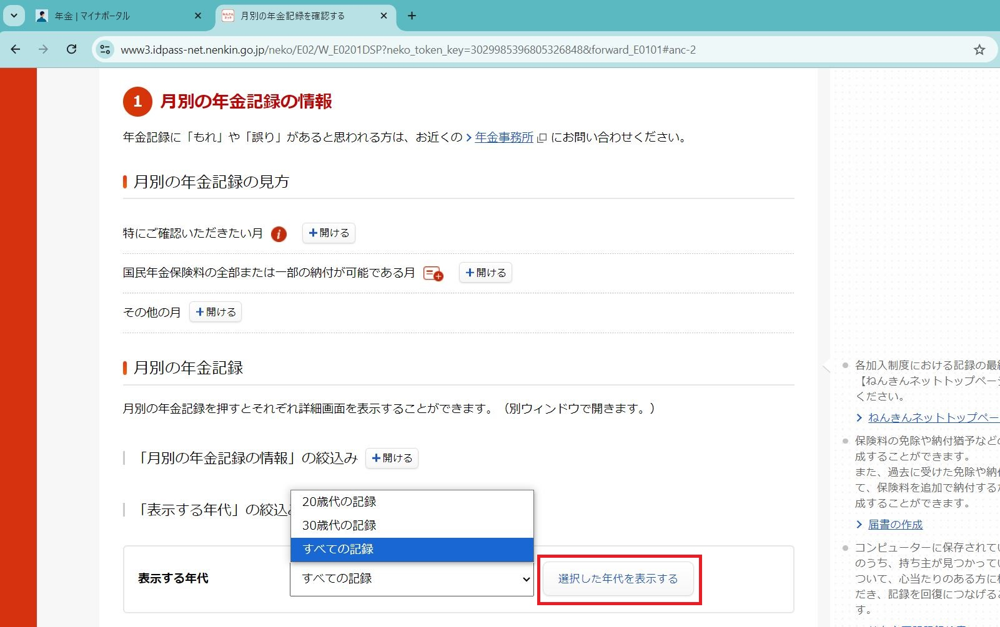</td>
                  </tr>
                </tbody>
              </table>
              <table style="border:none; border-collapse:collapse; cellspacing:0; cellpadding:0" >
                <thead>
                  <tr>
                    <th>2.5. Cuộn lên đầu trang, chọn <code class="language-plaintext highlighter-rouge">印刷する</code></th>
                  </tr>
                </thead>
                <tbody>
                  <tr>
                    <td>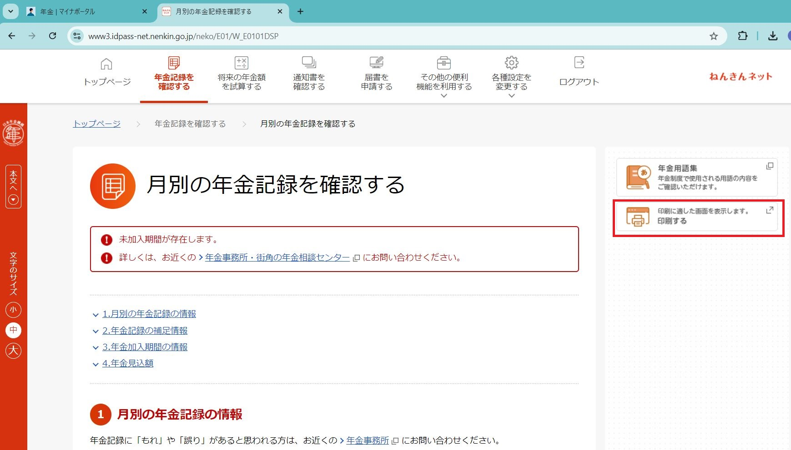</td>
                  </tr>
                </tbody>
              </table>
              <table style="border:none; border-collapse:collapse; cellspacing:0; cellpadding:0" >
                <thead>
                  <tr>
                    <th>2.6. Sau khi vào trang này, bấm tổ hợp phím <code class="language-plaintext highlighter-rouge">CTRL + P</code> để in ra giấy. Sau khi in, lấy bút dạ bôi đen các số 基礎年金番号</th>
                  </tr>
                </thead>
                <tbody>
                  <tr>
                    <td>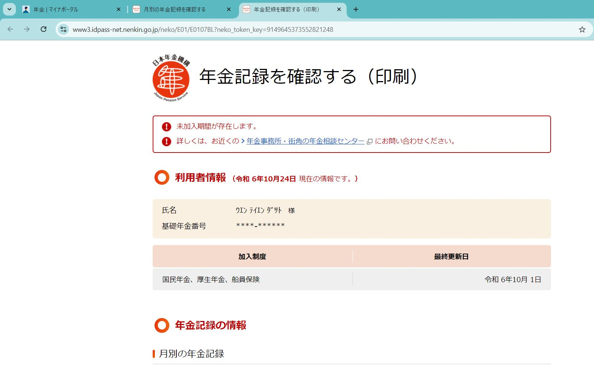</td>
                  </tr>
                </tbody>
              </table>
          

      

  

<!-- /.panel-group -->
