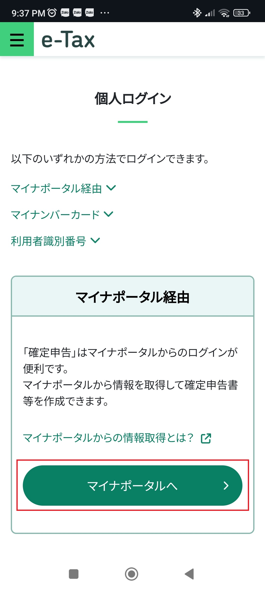
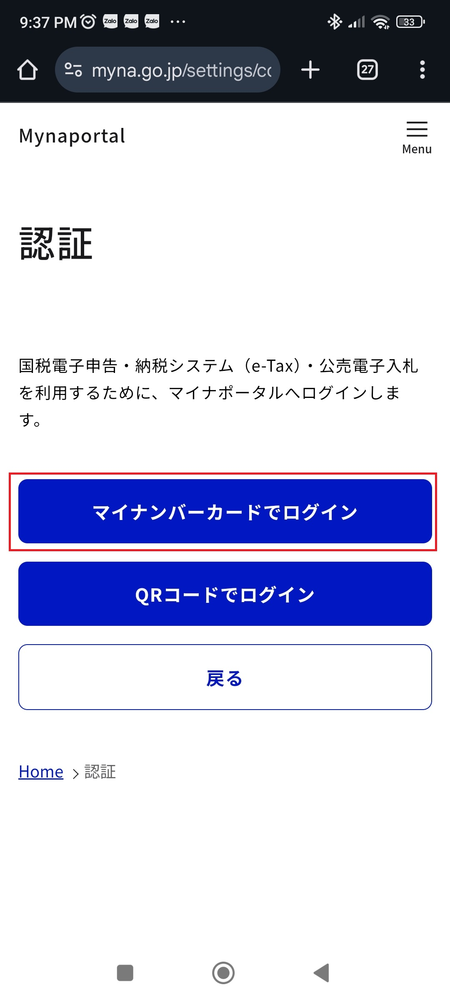
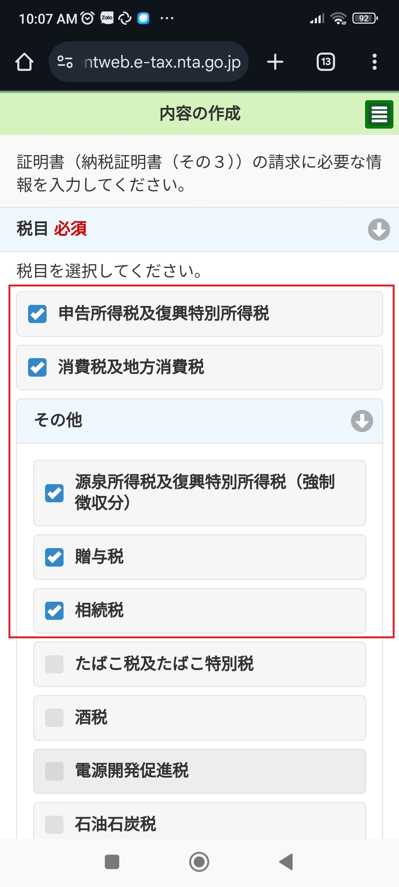
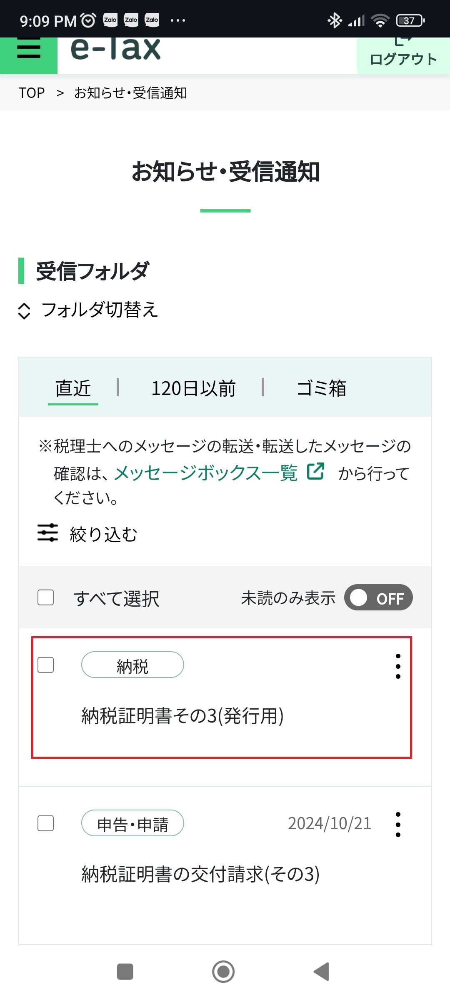
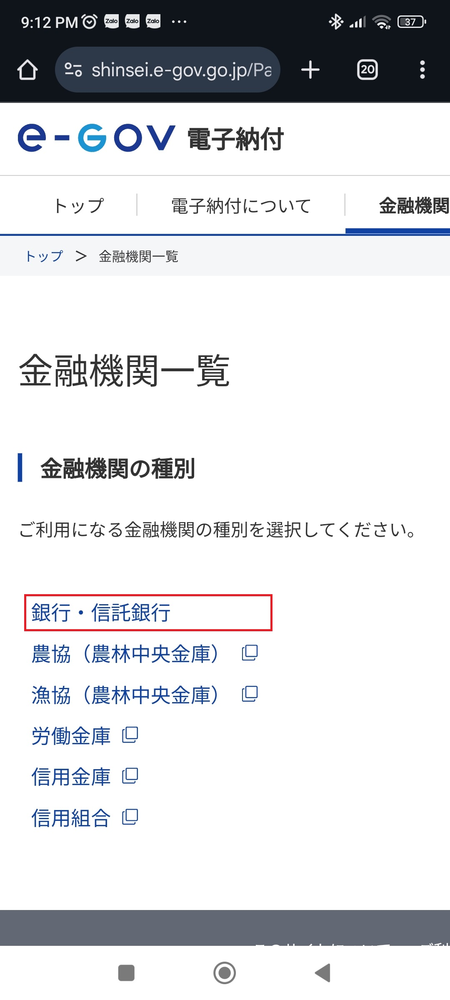

## Giấy chứng nhận không nợ thuế trông thế nào?

- Nếu bạn tìm kiếm hình ảnh trên Google với từ khóa `納税証明書（その３）`, bạn sẽ biết nó trông như thế nào.
- Về cơ bản, đây là một giấy do cục thuế cấp, xác nhận rằng bạn đang nợ hay không còn nợ 5 loại thuế sau:
  - 源泉所得税及び復興特別所得税
  - 申告所得税及び復興特別所得税
  - 相続税
  - 贈与税
  - 消費税及び地方消費税
- Để được cấp vĩnh trú, cả 5 mục trên phải được xác nhận là không còn nợ.

## Có những cách nào?

- Cách 1: đến trực tiếp cục thuế (税務署) nơi bạn cư trú.
- Cách 2: làm trực tuyến trên máy tính hoặc điện thoại thông minh.

Bài viết này sẽ hướng dẫn bạn cách làm trực tuyến.

## Cách làm trực tuyến.

### Chuẩn bị

1. Thẻ `My Number`.
2. Điện thoại thông minh.
- có khả năng đọc được thẻ NFC (Nếu điện thoại của bạn quẹt được SUICA hoặc PASMO là OK).
- đã cài đặt ứng dụng `Mynaportal`.
3. Máy in.

### Các bước thực hiện

  

      

          <h4 class="panel-title">
              <a class="noCrossRef accordion-toggle" data-toggle="collapse" data-parent="#accordion" href="#collapseOne">1. Đăng nhập vào trang e-Tax</a>
          </h4>
      

      

          

              <table style="border:none; border-collapse:collapse; cellspacing:0; cellpadding:0" >
                <thead>
                  <tr>
                    <th>1.1. Truy cập trang <a href="https://www.e-tax.nta.go.jp/">e-Tax</a>&nbsp;» <code class="language-plaintext highlighter-rouge">ログイン</code></th>
                    <th>1.2. Chọn <code class="language-plaintext highlighter-rouge">個人の方</code></th>
                  </tr>
                </thead>
                <tbody>
                  <tr>
                    <td></td>
                    <td></td>
                  </tr>
                </tbody>
              </table>
              <table style="border:none; border-collapse:collapse; cellspacing:0; cellpadding:0" >
                <thead>
                  <tr>
                    <th>1.3. Chọn <code class="language-plaintext highlighter-rouge">マイナポータルへ</code></th>
                    <th>1.4. Chọn <code class="language-plaintext highlighter-rouge">マイナンバーカードでログイン</code></th>
                  </tr>
                </thead>
                <tbody>
                  <tr>
                    <td></td>
                    <td></td>
                  </tr>
                </tbody>
              </table>
              <table style="border:none; border-collapse:collapse; cellspacing:0; cellpadding:0" >
                <thead>
                  <tr>
                    <th>1.5. Nhập mật khẩu thẻ My Number&nbsp;» <code class="language-plaintext highlighter-rouge">本人確認する</code></th>
                    <th>1.6. Đưa điện thoại áp lên trên thẻ</th>
                  </tr>
                </thead>
                <tbody>
                  <tr>
                    <td></td>
                    <td></td>
                  </tr>
                </tbody>
              </table>
              <table style="border:none; border-collapse:collapse; cellspacing:0; cellpadding:0" >
                <thead>
                  <tr>
                    <th>1.7. Chọn <code class="language-plaintext highlighter-rouge">外部サービスに戻る</code></th>
                    <th>1.8. Đăng nhập hoàn tất</th>
                  </tr>
                </thead>
                <tbody>
                  <tr>
                    <td></td>
                    <td></td>
                  </tr>
                </tbody>
              </table>
          

      

  

  <!-- /.panel -->
  

      

          <h4 class="panel-title">
              <a class="noCrossRef accordion-toggle" data-toggle="collapse" data-parent="#accordion" href="#collapseTwo">2. Gửi yêu cầu</a>
          </h4>
      

      

          

            <table style="border:none; border-collapse:collapse; cellspacing:0; cellpadding:0" >
              <thead>
                <tr>
                  <th>2.1. Chọn <code class="language-plaintext highlighter-rouge">申請・納付手続を行う</code></th>
                  <th>2.2. Chọn <code class="language-plaintext highlighter-rouge">納税証明書の交付請求（電子交付）</code></th>
                </tr>
              </thead>
              <tbody>
                <tr>
                  <td></td>
                  <td></td>
                </tr>
              </tbody>
            </table>
            <table style="border:none; border-collapse:collapse; cellspacing:0; cellpadding:0" >
              <thead>
                <tr>
                  <th>2.3. Chọn <code class="language-plaintext highlighter-rouge">提出先税務署</code></th>
                  <th>2.4. Chọn <code class="language-plaintext highlighter-rouge">税務署へ提出</code>&nbsp;» lựa chọn cục thuế mà bạn muốn lấy (ví dụ <code class="language-plaintext highlighter-rouge">千葉県</code>/<code class="language-plaintext highlighter-rouge">柏</code>)</th>
                </tr>
              </thead>
              <tbody>
                <tr>
                  <td></td>
                  <td></td>
                </tr>
              </tbody>
            </table>
            <table style="border:none; border-collapse:collapse; cellspacing:0; cellpadding:0" >
              <thead>
                <tr>
                  <th>2.5. Chọn <code class="language-plaintext highlighter-rouge">OK</code></th>
                  <th>2.6. Chọn <code class="language-plaintext highlighter-rouge">内容の作成</code></th>
                </tr>
              </thead>
              <tbody>
                <tr>
                  <td></td>
                  <td></td>
                </tr>
              </tbody>
            </table>
            <table style="border:none; border-collapse:collapse; cellspacing:0; cellpadding:0" >
              <thead>
                <tr>
                  <th>2.7. Chọn <code class="language-plaintext highlighter-rouge">交付請求する方の個人番号の入力</code></th>
                  <th>2.8. Nhập 12 số ở mặt sau thẻ <code class="language-plaintext highlighter-rouge">My Number</code></th>
                </tr>
              </thead>
              <tbody>
                <tr>
                  <td></td>
                  <td></td>
                </tr>
              </tbody>
            </table>
            <table style="border:none; border-collapse:collapse; cellspacing:0; cellpadding:0" >
              <thead>
                <tr>
                  <th>2.9. Chọn <code class="language-plaintext highlighter-rouge">交付ファイルの種類の選択</code></th>
                  <th>2.10. Chọn <code class="language-plaintext highlighter-rouge">PDF</code></th>
                </tr>
              </thead>
              <tbody>
                <tr>
                  <td></td>
                  <td></td>
                </tr>
              </tbody>
            </table>
            <table style="border:none; border-collapse:collapse; cellspacing:0; cellpadding:0" >
              <thead>
                <tr>
                  <th>2.11. Chọn <code class="language-plaintext highlighter-rouge">証明書の種類の選択、入力</code></th>
                  <th>2.12. Chọn <code class="language-plaintext highlighter-rouge">その３：未納税額がない証明</code></th>
                </tr>
              </thead>
              <tbody>
                <tr>
                  <td></td>
                  <td></td>
                </tr>
              </tbody>
            </table>
            <table style="border:none; border-collapse:collapse; cellspacing:0; cellpadding:0" >
              <thead>
                <tr>
                  <th>2.13. Chọn <code class="language-plaintext highlighter-rouge">税目</code></th>
                  <th>2.14. Tích vào 5 mục dưới đây</th>
                </tr>
              </thead>
              <tbody>
                <tr>
                  <td></td>
                  <td></td>
                </tr>
              </tbody>
            </table>
            <table style="border:none; border-collapse:collapse; cellspacing:0; cellpadding:0" >
              <thead>
                <tr>
                  <th>2.15. Cuộn trang xuống >> chọn <code class="language-plaintext highlighter-rouge">OK</code></th>
                  <th>2.16. Chọn <code class="language-plaintext highlighter-rouge">証明書の使用目的の選択</code></th>
                </tr>
              </thead>
              <tbody>
                <tr>
                  <td></td>
                  <td></td>
                </tr>
              </tbody>
            </table>
            <table style="border:none; border-collapse:collapse; cellspacing:0; cellpadding:0" >
              <thead>
                <tr>
                  <th>2.17. Chọn <code class="language-plaintext highlighter-rouge">その他</code>>> điền 永住申請 >> OK</th>
                  <th>2.18. Chọn <code class="language-plaintext highlighter-rouge">次へ</code></th>
                </tr>
              </thead>
              <tbody>
                <tr>
                  <td></td>
                  <td></td>
                </tr>
              </tbody>
            </table>
            <table style="border:none; border-collapse:collapse; cellspacing:0; cellpadding:0" >
              <thead>
                <tr>
                  <th>2.19. Chọn <code class="language-plaintext highlighter-rouge">送信</code></th>
                  <th>2.20. Chọn <code class="language-plaintext highlighter-rouge">はい</code></th>
                </tr>
              </thead>
              <tbody>
                <tr>
                  <td></td>
                  <td></td>
                </tr>
              </tbody>
            </table>
            <table style="border:none; border-collapse:collapse; cellspacing:0; cellpadding:0" >
              <thead>
                <tr>
                  <th>2.21. Chọn <code class="language-plaintext highlighter-rouge">受信通知の確認</code></th>
                  <th>2.22. Chọn <code class="language-plaintext highlighter-rouge">お知らせ・受信通知</code>để xem thông tin về đơn của mình</th>
                </tr>
              </thead>
              <tbody>
                <tr>
                  <td></td>
                  <td></td>
                </tr>
              </tbody>
            </table>
            <table style="border:none; border-collapse:collapse; cellspacing:0; cellpadding:0" >
              <thead>
                <tr>
                  <th>2.23. Chọn <code class="language-plaintext highlighter-rouge">納税証明書の交付請求（その３）</code></th>
                  <th>2.24. Đơn đăng kí đã được chấp nhận.</th>
                </tr>
              </thead>
              <tbody>
                <tr>
                  <td></td>
                  <td></td>
                </tr>
              </tbody>
            </table>
          

      

  

  <!-- /.panel -->
  

      

          <h4 class="panel-title">
              <a class="noCrossRef accordion-toggle" data-toggle="collapse" data-parent="#accordion" href="#collapseThree">3. Thanh toán trực tuyến</a>
          </h4>
      

      

          

            <table style="border:none; border-collapse:collapse; cellspacing:0; cellpadding:0" >
              <thead>
                <tr>
                  <th>3.1. Sau khoảng một vài tiếng, sẽ có một thông báo khác gọi là <code class="language-plaintext highlighter-rouge">納税証明書その３（発行用）</code></th>
                  <th>3.2. Cuộn trang xuống dưới >> chọn <code class="language-plaintext highlighter-rouge">発行する</code></th>
                </tr>
              </thead>
              <tbody>
                <tr>
                  <td></td>
                  <td></td>
                </tr>
              </tbody>
            </table>
            <table style="border:none; border-collapse:collapse; cellspacing:0; cellpadding:0" >
              <thead>
                <tr>
                  <th>3.3. Cuộn trang xuống dưới >> chọn <code class="language-plaintext highlighter-rouge">インターネットバンキング</code></th>
                  <th>3.4. Chọn <code class="language-plaintext highlighter-rouge">銀行・信託銀行</code> để thanh toán bằng tài khoản ngân hàng</th>
                </tr>
              </thead>
              <tbody>
                <tr>
                  <td></td>
                  <td></td>
                </tr>
              </tbody>
            </table>
            <table style="border:none; border-collapse:collapse; cellspacing:0; cellpadding:0" >
              <thead>
                <tr>
                  <th>3.5. Nếu dùng tài khoản của ngân hàng 三井住友 thì chọn <code class="language-plaintext highlighter-rouge">ま行</code></th>
                  <th>3.6. Chọn <code class="language-plaintext highlighter-rouge">三井住友銀行</code></th>
                </tr>
              </thead>
              <tbody>
                <tr>
                  <td></td>
                  <td></td>
                </tr>
              </tbody>
            </table>
            <table style="border:none; border-collapse:collapse; cellspacing:0; cellpadding:0" >
              <thead>
                <tr>
                  <th>3.7. Chọn <code class="language-plaintext highlighter-rouge">SMBC ダイレクトにログイン</code></th>
                  <th>3.8. Nhập chi nhánh, số tài khoản và mật khẩu</th>
                </tr>
              </thead>
              <tbody>
                <tr>
                  <td></td>
                  <td></td>
                </tr>
              </tbody>
            </table>
            <table style="border:none; border-collapse:collapse; cellspacing:0; cellpadding:0" >
              <thead>
                <tr>
                  <th>3.9. Chọn <code class="language-plaintext highlighter-rouge">三井住友銀行アプリを起動して承認</code> để kích hoạt ứng dụng 三井住友銀行アプリ</th>
                  <th>3.10. Chọn Authorize</th>
                </tr>
              </thead>
              <tbody>
                <tr>
                  <td></td>
                  <td></td>
                </tr>
              </tbody>
            </table>
            <table style="border:none; border-collapse:collapse; cellspacing:0; cellpadding:0" >
              <thead>
                <tr>
                  <th>3.11. Quá trình xác thực trên ứng dụng 三井住友銀行アプリ đã hoàn tất</th>
                  <th>3.12. Bạn mở lại ứng dụng Chrome >> chọn <code class="language-plaintext highlighter-rouge">承認操作を完了しました</code></th>
                </tr>
              </thead>
              <tbody>
                <tr>
                  <td></td>
                  <td></td>
                </tr>
              </tbody>
            </table>
            <table style="border:none; border-collapse:collapse; cellspacing:0; cellpadding:0" >
              <thead>
                <tr>
                  <th>3.13. Chọn tài khoản thanh toán >> 次へ</th>
                  <th>3.14. Chọn <code class="language-plaintext highlighter-rouge">実行</code></th>
                </tr>
              </thead>
              <tbody>
                <tr>
                  <td></td>
                  <td></td>
                </tr>
              </tbody>
            </table>
            <table style="border:none; border-collapse:collapse; cellspacing:0; cellpadding:0" >
              <thead>
                <tr>
                  <th>3.15. Quay trở lại <code class="language-plaintext highlighter-rouge">納税証明書その３（発行用）</code></th>
                  <th>3.16. Bây giờ, bạn có thể tải được giấy chứng nhận và in ra giấy.</th>
                </tr>
              </thead>
              <tbody>
                <tr>
                  <td></td>
                  <td></td>
                </tr>
              </tbody>
            </table>
          

      

  

<!-- /.panel-group -->

