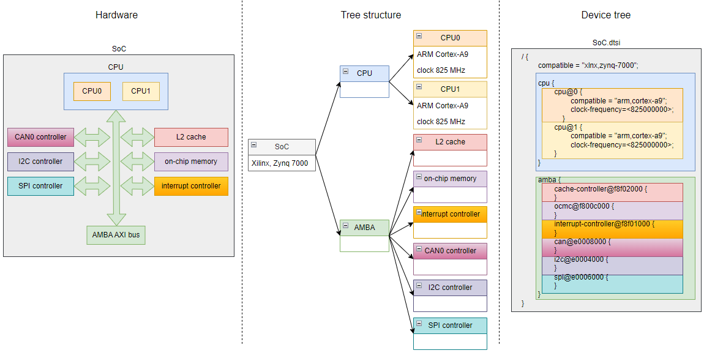
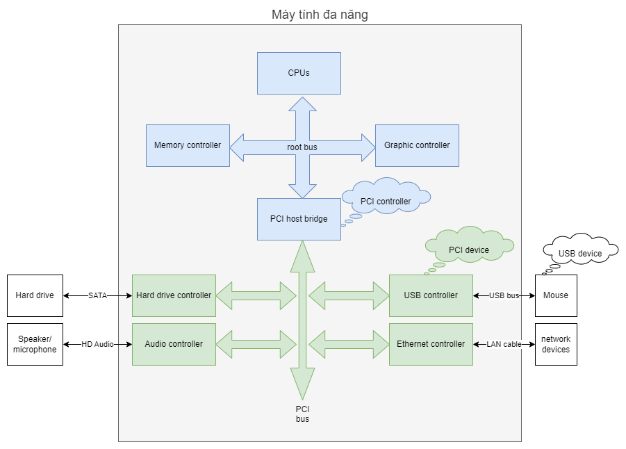

## Device Tree là gì?

- Device Tree là một cấu trúc dữ liệu kiểu cây, gồm một node gốc (root node) và các node con (child node).
- Thông thường, mỗi node con của Device Tree mô tả một thiết bị trong hệ thống.
- Trong quá trình khởi động hệ thống, bootloader sẽ đưa Device Tree vào trong bộ nhớ, sau đó truyền địa chỉ của Device Tree cho hệ điều hành. Hệ điều hành sẽ phân tích Device Tree để tìm ra trình điều khiển (driver) phù hợp với từng thiết bị.

## Tại sao Device Tree được sử dụng rộng rãi trong các hệ thống nhúng?

Để hệ điều hành có thể quản lý được hệ thống, nó cần biết trong hệ thống có những thiết bị gì, được kết nối vào bus nào, địa chỉ của thiết bị trên bus đó là gì, ...

Trong máy tính đa năng, các thiết bị thường xuyên được cắm vào, rút ra, hoặc bị thay thế. Tuy nhiên, người dùng không phải ai cũng hiểu biết về máy tính. Việc phải tìm kiếm và cài đặt trình điều khiển cho thiết bị khá phiền phức và mất thời gian. Do vậy, để thuận tiện cho người sử dụng, hệ thống máy tính được trang bị tính năng PnP (Plug and Play). Người dùng chỉ cần cắm thiết bị vào máy tính là có thể dùng được mà không cần phải làm thêm gì.

Để hỗ trợ tính năng PnP, máy tính được trang bị các bus như PCI, hoặc USB. Controller trên các bus này có một khả năng gọi là bus enumeration hay discoverability. Khả năng này cho phép PCI controller hay USB controller khám phá xem trong hệ thống có những thiết bị nào, đặc điểm của mỗi thiết bị ra sao. Dựa vào các thông tin đó, hệ điều hành sẽ lựa chọn được một trình điều khiển phù hợp cho từng thiết bị.

Trong các hệ thống nhúng, các thiết bị hiếm khi thay đổi. Thêm vào đó, để giảm giá thành, các hệ thống nhúng thường được trang bị các bus có chi phí thi công thấp như UART, I2C, SPI. Controller trên bus này không có khả năng bus enumeration. Do đó, để có thể biết được hệ thống gồm những thiết bị nào, kết nối với nhau ra sao, hệ điều hành sử dụng một trong các cách sau:
- Hard coded trong hệ điều hành.
- Sử dụng bảng ACPI.
- Sử dụng Device Tree.
