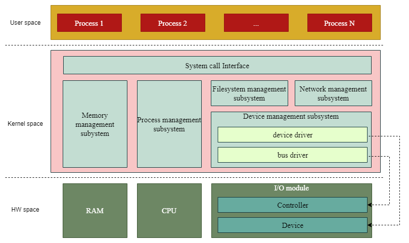

## Driver là gì?

Driver, còn gọi là trình điều khiển, là một phần mềm trong hệ thống máy tính.

Hình vẽ trên mô tả kiến trúc tổng quát của hệ thống máy tính sử dụng Linux. Tuy driver có thể được triển khai như một tiến trình trên use space, nhưng phần lớn chúng được triển khai trong kernel space.

| Yếu tố so sánh | kernel-space driver | user-space driver |
|---| ---|---|
| Chế độ thực thi | kernel mode | user mode |
| Không gian thực thi | kernel space | user space |
| Hiệu năng | cao | thấp |
| Hậu quả khi driver có lỗi | có thể ảnh hưởng đến toàn bộ hệ thống | chỉ ảnh hưởng đến driver đó |
| Khả năng truy cập phần cứng | không giới hạn | giới hạn qua các system call |
| Khả năng gỡ lỗi | khó hơn | dễ hơn |
| Ứng dụng | điều khiển các thiết bị cần phải hoạt động trong suốt thời gian chạy của hệ thống, hoặc các thiết bị có tốc độ hoạt động cao | điều khiển các thiết bị đơn giản, có tốc độ hoạt động tương đối thấp |

## Driver có những loại nào?

Có nhiều cách phân loại driver. Ví dụ:
- Nếu dựa theo vị trí của thiết bị trên bus, có thể chia thiết bị làm 2 loại: controller và device. Tương ứng, có 2 loại driver:
  - bus driver (hoặc controller driver). Ví dụ:
    - [I2C bus driver](https://github.com/torvalds/linux/blob/master/drivers/i2c/busses/i2c-imx.c)
    - [USB bus driver](https://github.com/torvalds/linux/blob/master/drivers/usb/host/ehci-hcd.c)
  - device driver. Ví dụ:
    - [I2C device driver](https://github.com/torvalds/linux/blob/master/drivers/rtc/rtc-ds1307.c)
    - [USB device driver](https://github.com/torvalds/linux/blob/master/drivers/usb/storage/usb.c)
- Nếu dựa theo khả năng truy cập dữ liệu của thiết bị, có thể chia thiết bị làm 3 loại: char device, block device và net device. Tương ứng, có 3 loại driver:
  - char driver (truy cập dữ liệu ở cấp độ ký tự)
  - block driver (truy cập dữ liệu ở cấp độ khối)
  - net driver (truy cập dữ liệu ở cấp độ gói tin)
- Nếu dựa theo cách driver được biên dịch và tải nạp vào kernel, có thể chia driver làm 2 loại:
  - built-in driver (được tích hợp vào trong kernel image và khởi động cùng kernel)
  - loadable driver (độc lập với kernel image, có thể tải nạp vào hoặc dỡ bỏ ra khỏi kernel space theo nhu cầu).

## Driver mang lại lợi ích gì?

- Giúp cho thiết bị trở nên dễ sử dụng: các chương trình ứng dụng có thể sử dụng thiết bị phần cứng mà không cần biết chi tiết thiết bị đó có cấu trúc thế nào, hoạt động ra sao.
- Giúp cho hệ thống dễ được mở rộng: các thiết bị phần cứng mới có thể được hỗ trợ mà không cần viết lại hệ điều hành.
- Giúp cho quá trình phát triển phần mềm trở nên dễ dàng: các quá trình phát triển hệ điều hành, chương trình ứng dụng, phần cứng có thể thực hiện độc lập.
