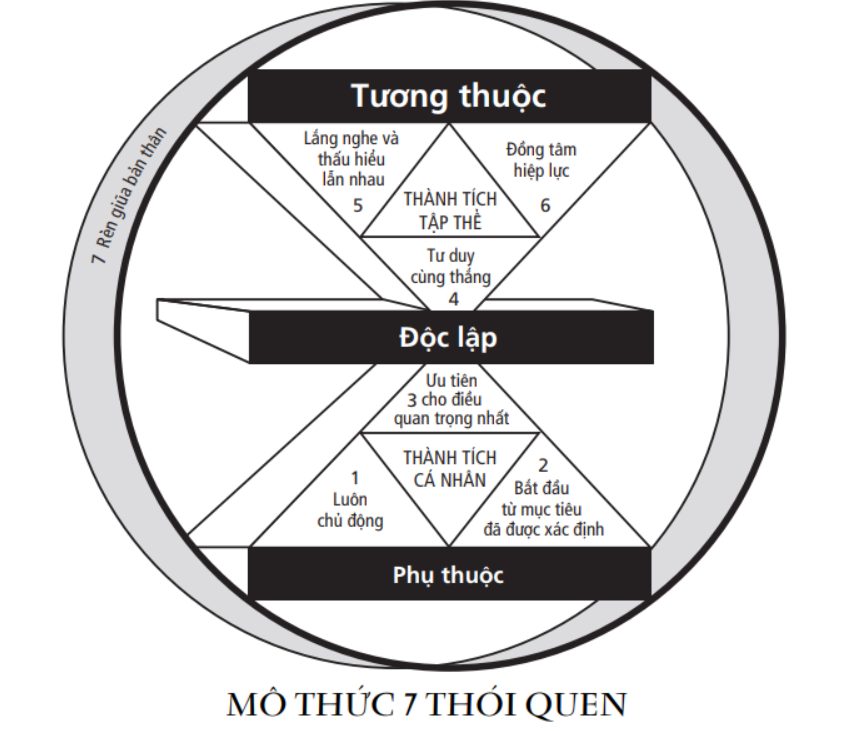

## Tính cách và nhân cách

Có 2 trường phái xây dựng thành công:
- dựa trên tính cách = các đức tính như chính trực, khiêm tốn, giản dị, can đảm, chăm chỉ...
- dựa trên nhân cách = các quy tắc ứng xử + thái độ sống tích cực.

Theo tác giả, cả tính cách và nhân cách đều có những đóng góp trên con đường dẫn tới thành công, nhưng tính cách là yếu tố chính yếu, còn nhân cách chỉ là thứ yếu. Nhân cách chỉ giúp mình gây được ấn tượng trong những lần tiếp xúc đầu tiên, hay trong các mối quan hệ thoáng qua. Còn tính cách mới là yếu tố chính, giúp cho mình xây dựng các mối quan hệ lâu dài và vững chắc. Tính cách bên trong có sức thuyết phục hơn nhiều so với hành động và lời nói bên ngoài.

## Mô thức

Mô thức là cách chúng ta nhìn nhận thế giới thực tế, không phải bằng trực giác, mà là bằng nhận thức của chúng ta. Có thể liên tưởng rằng, mô thức của chúng ta về thế giới thực tế cũng tương tự như một tấm bản đồ mô tả lãnh thổ thực địa. Mô thức là nguồn gốc của thái độ và hành vi. Rõ ràng, chúng ta sẽ không giúp một người qua đường nếu chúng ta nghĩ rằng người đó còn trẻ. Đôi khi, chúng ta cố gắng nói và làm khác với những gì ta nhận thấy, nhưng điều đó chắc chắn sẽ không duy trì được lâu.

Các mô thức chúng ta đang sử dụng chịu ảnh hưởng bởi gia đình, trường học, môi trường làm việc và các tiêu chuẩn xã hội. Nhiều trong số đó không phản ánh thế giới một cách chân thực. Giống như việc bạn sử dụng sai tấm bản đồ để tìm đường, nếu mô thức của bạn không sát với thực tế, thì mọi nỗ lực hành động sẽ kết thúc trong vô vọng, và mọi thái độ tích cực sẽ trở nên vô nghĩa. Mọi rắc rối trong cuộc sống đều phát sinh do mô thức của chúng ta bị sai lệch, méo mó hoặc nhuốm màu sắc tình cảm. Tuy nhiên, ít khi chúng ta nghi ngờ về độ chính xác của nó. Hai người có thể có hai cái nhìn khác nhau về cùng một sự vật, hiện tượng, nhưng cả hai đều khăng khăng mình mới là đúng.

Để đi đúng đường, ta cần thay thế bằng một tấm bản đồ chính xác. Để giải quyết vấn đề một cách hiệu quả, ta cần thay đổi mô thức sao cho sát với thực tế hơn. Nếu chỉ thay đổi thái độ và hành vi một cách khiên cưỡng, thì vấn đề chỉ tạm thời lắng xuống. Nhưng nếu thay đổi mô thức, thì thái độ và hành vi sẽ tự thay đổi theo, do đó mà vấn đề sẽ được giải quyết tận gốc.

Và để sát với thực tế, mô thức cần được xây dựng dựa trên các nguyên tắc phù hợp với quy luật tự nhiên. Có nghĩa là, để có được những thành công cá nhân, cũng như những thành công trong mối quan hệ với người khác, chúng ta phải lấy nguyên tắc làm cơ sở cho suy nghĩ và hành động của mình.

## Nguyên tắc và giá trị

Giá trị là những điều được chúng ta coi trọng, và nó nằm bên trong con người chúng ta. Giá trị chi phối thái độ và hành động của chúng ta. Bằng việc thay đổi nhận thức, chúng ta sẽ thay đổi được các giá trị của bản thân.

Nguyên tắc là các quy luật tự nhiên, nằm bên ngoài chúng ta. Nguyên tắc tồn tại, bất kể chúng ta có nhận ra hay không. Nguyên tắc chi phối mọi kết quả từ hành động của chúng ta. Tuân thủ nguyên tắc, chúng ta sẽ tồn tại và phát triển. Vi phạm nguyên tắc, chúng ta sẽ suy yếu và diệt vong.

## Quan điểm "bắt đầu từ bên trong"

Theo quan điểm này, để giải quyết được những thách thức trong cuộc sống cũng như đạt được những điều mình mong muốn, chúng ta phải thay đổi, bắt đầu từ bên trong bản thân chúng ta. "Bắt đầu từ bên trong" nghĩa là xây dựng mô thức và tính cách bên trong bản thân mình dựa trên các nguyên tắc. Ví dụ:
- Nếu muốn có một cuộc hôn nhân hạnh phúc, thay vì bắt vợ mình phải thay đổi, thì hãy là người tạo ra không khí tích cực, bỏ qua những chuyện không vui.
- Nếu muốn con mình ngoan ngoãn, thay vì bắt con mình phải nghe lời, thì hãy là một người cha gương mẫu.
- Nếu muốn thu nhập cao hơn, thay vì đòi công ty phải tăng lương cho, hãy là một nhân viên có trách nhiệm, cống hiến và luôn giúp đỡ đồng nghiệp.
- Nếu muốn người khác tin tưởng mình, trước hết mình phải giữ lời hứa với chính mình.
- Nếu muốn lãnh đạo người khác, trước hết phải lãnh đạo được chính mình.
- Nếu muốn cải thiện mối quan hệ với người khác, trước hết cần phải hoàn thiện bản thân mình.

## Thói quen

Thói quen là những hành động chúng ta thường làm. Thói quen thể hiện tính cách của chúng ta. Thói quen quyết định sự thành công (hay tính hiệu quả) trong mọi hoạt động.

Thói quen có một sức hút rất lớn. Có thể liên tưởng, thói quen giống như lực hút của Trái Đất. Trọng lực cản trở con người bay vào không gian, nhưng cũng giúp liên kết thế giới này, giữ cho vạn vật được ổn định. Tương tự, một thói quen có thể cản trở chúng ta trở thành phiên bản tốt hơn của mình, nhưng cũng có thể tạo ra những yếu tố cần thiết nhằm mang lại thành công trong cuộc sống. Thói quen có thể xây dựng được, và cũng có thể từ bỏ được. Cả hai đều đòi hỏi phải có một quyết tâm cao. Mọi sự cất cánh đều cần một nỗ lực phi thường.

Thói quen là giao điểm của tri thức, kỹ năng và khát vọng. Để xây dựng được một thói quen, đòi hỏi phải có được cả 3 yếu tố này:
- Tri thức = làm gì, tại sao làm.
- Kỹ năng = làm như thế nào.
- Khát vọng = động cơ thúc đẩy hành động.

Lấy ví dụ, để có được thói quen lắng nghe người khác, bạn cần có:
- Tri thức = hiểu tại sao phải lắng nghe người khác.
- Kỹ năng = biết cách lắng nghe người khác như thế nào là hợp lý.
- Khát vọng = mong muốn giao tiếp với người khác một cách chân thành.

## Quá trình trưởng thành

Cuộc đời của mỗi con người đều tuân theo một trình tự. Mỗi bước phát triển đều quan trọng và phải diễn ra theo thời gian, không thể bỏ qua bước nào. Đó là quá trình chuyển đổi từ phụ thuộc sang độc lập, rồi tương thuộc.
- Người phụ thuộc thì dựa vào người khác để đạt được điều mình muốn.
- Người độc lập thì dựa vào chính nỗ lực của bản thân để đạt được điều mình muốn.
- Người tương thuộc thì biết kết hợp nỗ lực của mình và người khác để đạt được những kết quả phi thường.

Tuy nhiên, quá trình trưởng thành có thể không đồng đều ở các mặt thể chất, trí tuệ và tình cảm.

| Mặt | Phụ thuộc | Độc lập  | Tương thuộc  |
|---|---|---|---|
| Thể chất | Dựa vào sự giúp đỡ của người khác để ăn, uống, vệ sinh. | Tự mình làm lấy mọi việc.  | Kết hợp sức mạnh của mọi người để có được kết quả tốt nhất. |
| Trí tuệ | Nhờ người khác suy nghĩ hộ mọi vấn đề trong cuộc sống. | Tự suy nghĩ sáng tạo, phân tích vấn đề, sắp xếp và trình bày ý kiến của mình một cách dễ hiểu. | Kết hợp ý tưởng của những người khác với những ý tưởng của riêng mình để tạo ra một ý tưởng độc đáo và tuyệt vời. |
| Tình cảm | Dựa vào nhận xét của người khác để cảm thấy mình có giá trị. Tìm kiếm sự cảm thông của người khác để cảm thấy mình không có lỗi. | Tự làm chủ bản thân, cảm nhận được chính mình và không bị chi phối bởi suy nghĩ, nhận xét của người khác. | Dù nhận ra ý nghĩa của bản thân, chúng ta cũng chia sẻ tình cảm với người khác. |

Trong một cuộc sống mà mọi sự vật đều tác động qua lại lẫn nhau, chúng ta sẽ đạt được thành công nếu cũng là người tương thuộc. Người độc lập chỉ có thể trở thành một cá nhân tốt. Còn người tương thuộc sẽ trở thành một nhà lãnh đạo tốt hay đồng đội tốt. Nhưng để trở thành một người tương thuộc, trước hết chúng ta phải trở thành một người độc lập.

## Thành công (tính hiệu quả)

Thành công (hay tính hiệu quả) nằm ở nguyên tắc cân bằng giữa sản phẩm và phương tiện sản xuất. Nếu muốn thành công, bạn buộc phải tuân thủ nguyên tắc này. Nếu quá tập trung vào sản phẩm, bạn sẽ làm tổn hại sức khỏe, hư hại máy móc, cạn kiệt vốn liếng và phá vỡ các mối quan hệ. Còn nếu quá tập trung vào phương tiện sản xuất, thì cũng giống như việc mỗi ngày chạy bộ 3 tiếng đồng hồ để kéo dài tuổi thọ thêm vài năm mà thực ra ngần ấy thời gian cũng chỉ dùng để chạy.

| Phân loại sản phẩm | Ví dụ sản phẩm  | Ví dụ phương tiện sản xuất | Hậu quả nếu mất cân bằng |
|---|---|---|---|
| Tài sản vật chất | Sân cỏ đẹp | Máy cắt cỏ | Nếu chỉ chú trọng vào sân cỏ đẹp mà không bảo dưỡng định kì máy cắt cỏ, chiếc máy sẽ nhanh hỏng hóc. Do đó, sẽ không thể có sân cỏ đẹp dài lâu. |
| Tài sản tài chính| Thu nhập cao | Kỹ năng và trình độ tay nghề | Nếu chỉ gắng sức làm việc mà không nâng cao tay nghề, thì về lâu dài, không những sức khỏe và thu nhập có nguy cơ giảm sút, mà chúng ta sẽ bị trói buộc vào hoàn cảnh và phải nghe theo ý kiến của cấp trên. |
| Tài sản con người | Con cái tốt | Mối quan hệ với con cái | Nếu không những không chịu trao đổi và lắng nghe các con, mà lại thường xuyên áp đặt hoặc nuông chiều các con, chúng sẽ lớn lên mà không có tự tin, quyết tâm, kỷ luật và trách nhiệm với cuộc đời chúng, cũng như với người khác. |

## 7 thói quen của người thành công

Bảy thói quen được trình bày trong cuốn sách này được xây dựng dựa trên nguyên tắc cân bằng giữa sản phẩm và phương tiện sản xuất. Rèn luyện theo bảy thói quen này sẽ giúp tính cách của chúng ta ngày một trưởng thành hơn.

- Ba thói quen đầu tiên sẽ giúp bạn rèn luyện tính cách độc lập, và bạn sẽ đạt được những thành công cá nhân.
    - Thói quen thứ nhất là luôn chủ động. Rèn luyện được thói quen này, bạn sẽ là người sáng tạo mọi thứ, và chịu trách nhiệm đối với mọi hành vi của mình.
    - Thói quen thứ hai là luôn bắt đầu mọi việc từ mục tiêu xác định. Rèn luyện được thói quen này, bạn sẽ viết ra kịch bản cho cuộc đời mình.
    - Thói quen thứ ba là luôn ưu tiên cho điều quan trọng nhất. Rèn luyện được thói quen này, bạn sẽ thực hiện được các kịch bản do chính mình viết ra.
- Ba thói quen tiếp theo sẽ giúp bạn rèn luyện tính cách tương thuộc, và bạn sẽ đạt được những thành tích tập thể.
    - Thói quen thứ tư là luôn hợp tác với tư duy cùng thắng. Rèn luyện được thói quen này, bạn sẽ tìm ra được giải pháp làm hài lòng đôi bên.
    - Thói quen thứ năm là luôn lắng nghe và thấu hiểu. Rèn luyện được thói quen này, người khác sẽ luôn mở lòng với bạn. Từ đó, bạn sẽ hiểu được những điều họ muốn, góp phần tìm ra giải pháp cùng thắng.
    - Thói quen thứ sáu là cùng đồng tâm hiệp lực với người khác. Rèn luyện được thói quen này, bạn sẽ kết hợp được với người khác để tạo ra những kết quả vượt trội.
- Thói quen thứ bảy là luôn rèn giũa bản thân trên các phương diện thể chất, trí tuệ, tinh thần và tình cảm. Rèn luyện được thói quen này, bạn sẽ ngày càng trưởng thành và với tới được nhiều điều tốt đẹp hơn.
